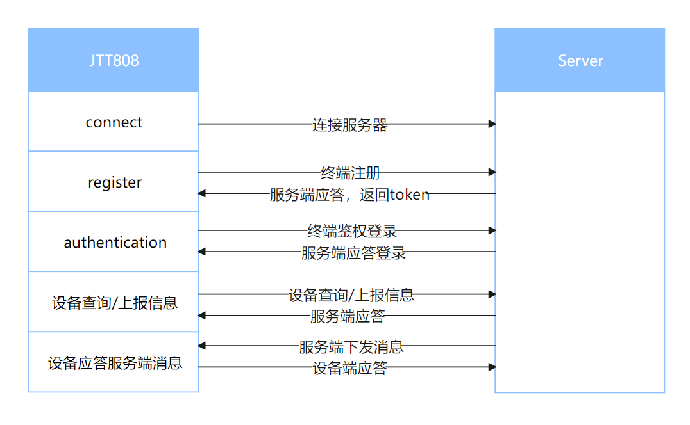

# JTT808用户指导手册

## **注意事项**

- 该项目只提供JTT808协议客户端功能, 服务端需对接三方提供的服务端, 或自己搭建开源服务端进行使用。
- 该项目只提供了功能接口, 具体的使用业务需另行开发。
- JTT808协议中要求对发送失败的数据进行存储与重发, 该项目不进行失败数据存储, 需在业务层实现失败数据的存储与重发。
- 心跳会在鉴权接口成功之后自动启动, 无需手动启动心跳。
- 服务端下行数据与中断请求应答通过`set_callback`函数注册回调函数进行处理。

## 功能交互示意图



## 使用说明

### 1. 参数配置

#### 1.1 终端参数配置设置

```python
from usr.jt_message import TerminalParams

# 终端参数初始化
TerminalParamsObj = TerminalParams()
# 主服务器地址
TerminalParamsObj.set_params(0x0013, "220.180.239.212:7611")
# 终端心疼发送时间间隔
TerminalParamsObj.set_params(0x0001, 60)
# TCP消息应答超时时间
TerminalParamsObj.set_params(0x0002, 30)
# 违规行驶时段范围
TerminalParamsObj.set_params(0x0032, 8, 12, 17, 30)
# 终端参数信息, `value`值用于业务处理, `hex`值用于上报服务端
param_data = TerminalParamsObj.get_params()
print(param_data)
# {50: {'value': (8, 12, 17, 30), 'hex': '8C111E'}, 1: {'value': 60, 'hex': '0000003C'}, 2: {'value': 30, 'hex': '0000001E'}, 19: {'value': '220.180.239.212:7611', 'hex': '3232302E3138302E3233392E3231323A37363131'}}
```

#### 1.2 定位状态配置设置

```python
from usr.jt_message import LocStatusConfig

LocStatusConfigObj = LocStatusConfig()
# 设置ACC已开启
LocStatusConfigObj.set_config("acc_onoff", 1)
# 设置已开启定位
LocStatusConfigObj.set_config("loc_status", 1)
# 设置纬度方向为北纬
LocStatusConfigObj.set_config("NS_latitude", 0)
# 设置经度方向为东经
LocStatusConfigObj.set_config("EW_longitude", 0)
```

#### 1.3 定位告警配置设置

```python
from jt_message import LocAlarmWarningConfig

LocAlarmWarningConfigObj = LocAlarmWarningConfig()

# 超速报警
name = "over_speed_alarm"
onoff = 1
shield_switch = 1
sms_switch = 1
shoot_switch = 1
shoot_store = 1
key_sign = 1
LocAlarmWarningConfigObj.set_alarm(name, onoff, shield_switch, sms_switch, shoot_switch, shoot_store, key_sign)

# 疲劳驾驶报警
name = "fatigue_driving_alarm"
onoff = 1
shield_switch = 1
sms_switch = 1
shoot_switch = 1
shoot_store = 1
key_sign = 1
LocAlarmWarningConfigObj.set_alarm(name, onoff, shield_switch, sms_switch, shoot_switch, shoot_store, key_sign)
```

#### 1.4 附加定位配置设置

```python
from jt_message import LocAdditionalInfoConfig

LocAdditionalInfoConfigObj = LocAdditionalInfoConfig()
# 获取设置的车辆里程数
LocAdditionalInfoConfigObj.set_mileage(101)
# 获取设置的车辆油量数
LocAdditionalInfoConfigObj.set_oil_quantity(50)
# 设置车速
LocAdditionalInfoConfigObj.set_speed(60)
# 设置车辆胎压
values = [240, 240, 235, 230]
LocAdditionalInfoConfigObj.set_tire_pressure(values)
```

### 2. 连接初始化

#### 2.1. 功能初始化

```python
from usr.jtt808 import JTT808

ip = "220.180.239.212"
port = 7611
method = "TCP"
version = "2019"
client_id = "18888888888"

jtt808_obj = JTT808(ip=ip, port=port, method=method, version=version, client_id=client_id)
```

#### 2.2. 注册回调函数

```python
def test_callback(args):
    header = args["header"]
    data = args["data"]
    # TODO: Different response for different server message.
    pass

res = jtt808_obj.set_callback(test_callback)
print(res)
# True
```

#### 2.3. 连接服务器

```python
conn_res = jtt808_obj.connect()
print(conn_res)
# True
```

#### 2.4. 设置消息加密(该功能需服务端先下发服务端公钥信息才可设置生效)

```python
from usr.jtt808 import GENERAL_ANSWER_MSG_ID

def test_callback(args):
    header = args["header"]
    data = args["data"]
    # GENERAL_ANSWER_MSG_ID 中包含了使用通用应答的所有服务端消息ID
    if header["message_id"] in GENERAL_ANSWER_MSG_ID:
        # TODO: 根据不同的消息进行业务处理后应答
        jtt808_obj.general_answer(header["serial_no"], header["message_id"])
    # TODO: 消息ID不在 GENERAL_ANSWER_MSG_ID中的, 需根据对应的应答接口进行应答, 具体见API文档.

res = jtt808_obj.set_callback(test_callback)
print(res)
# True
```

### 3. 终端注册&鉴权

#### 3.1. 终端注册

```python
import uos
import modem
from usr.jt_message import LicensePlateColor

province_id = "34"
city_id = "0100"
manufacturer_id = "quectel"
terminal_model = uos.uname()[0].split("=")[1]
terminal_id = modem.getDevImei()
license_plate_color = LicensePlateColor.blue
license_plate = "皖A88888"

register_res = jtt808_obj.register(province_id, city_id, manufacturer_id, terminal_model, terminal_id, license_plate_color, license_plate)
print(register_res)
# {'registration_result': 0, 'serial_no': 0, 'auth_code': '865306057798238'}
```

#### 3.2. 终端鉴权

```python
import modem

auth_code = "865306057798238"
imei = modem.getDevImei()
app_version = "v1.0.0"
res = jtt808_obj.authentication(auth_code, imei, app_version)
print(res)
# {'message_id': 258, 'serial_no': 1, 'result_code': 0}
```

### 4. 终端与服务器信息交互

#### 4.1. 查询服务器时间

```python
res = jtt808_obj.query_server_time()
print(res)
# {'utc_time': '2022-06-17 08:25:44'}
```

#### 4.2. 生成定位信息并上报

```python
import utime
from usr.jt_message import LocAlarmWarningConfig, LocStatusConfig, LocAdditionalInfoConfig

def test_init_loction_data():
    LocStatusConfigObj = LocStatusConfig()
    for key in LocStatusConfigObj._loc_cfg_offset.__dict__.keys():
        LocStatusConfigObj.set_config(key, 1)

    LocAlarmWarningConfigObj = LocAlarmWarningConfig()

    LocAdditionalInfoConfigObj = LocAdditionalInfoConfig()
    LocAdditionalInfoConfigObj.set_mileage(100)
    LocAdditionalInfoConfigObj.set_oil_quantity(32.5)
    LocAdditionalInfoConfigObj.set_speed(0)

    alarm_flag = LocAlarmWarningConfigObj.value()
    loc_status = LocStatusConfigObj.value()
    latitude = 31.824845156501
    longitude = 117.24091089413
    altitude = 120
    speed = 0
    direction = 0
    time = "{}{:02d}{:02d}{:02d}{:02d}{:02d}".format(*(utime.localtime()[:6]))[2:]
    loc_additional_info = LocAdditionalInfoConfigObj.value()

    return (alarm_flag, loc_status, latitude, longitude, altitude, speed, direction, time, loc_additional_info)

loc_data = test_init_loction_data()
response_msg_id = None
response_serial_no = None
args = [response_msg_id, response_serial_no]
args.extend(list(loc_data))
res = jtt808_obj.loction_report(*args)
print(res)
# {'message_id': 512, 'serial_no': 3, 'result_code': 0}
```

#### 4.3. 定位信息批量上报

```python
loc_data = test_init_loction_data()
loc_datas = [loc_data] * 10
data_type = 0
res = jtt808_obj.location_bulk_report(data_type, loc_datas)
print(res)
# {'message_id': 1796, 'serial_no': 4, 'result_code': 0}
```

#### 4.4. 事件上报

```python
# event id from server message 0x8301 set event.
event_id = 12
res = jtt808_obj.event_report(event_id)
print(res)
# {'message_id': 769, 'serial_no': 5, 'result_code': 0}
```

#### 4.5. 升级结果上报

```python
upgrade_type = 0
result_code = 0
res = jtt808_obj.upgrade_result_report(upgrade_type, result_code)
print(res)
# {'message_id': 264, 'serial_no': 6, 'result_code': 0}
```

#### 4.6. 电子运单上报

```python
with open("/path/xxx.xxx", "rb") as f:
    data = f.read()
    res = jtt808_obj.electronic_waybill_report(data)
    print(res)
# {'message_id': 1793, 'serial_no': 7, 'result_code': 0}
```

#### 4.7. 信息点播/取消

```python
# info type from server message 0x8303, information on demand menu settings.
info_type = 12
# 1 - demand, 0 - cancel
onoff = 1
res = jtt808_obj.information_demand_cancellation(info_type, onoff)
print(res)
# {'message_id': 771, 'serial_no': 8, 'result_code': 0}
```

#### 4.8. CAN总线数据上传

```python
recive_time = ("{:2d}" * 3 + "0000").format(*(utime.localtime()[3:6]))
can_channel_no = 0
frame_type = 0
collection_method = 0
can_id = 0
can_data = "123"
can_datas = [(can_channel_no, frame_type, collection_method, can_id, can_data)] * 3
res = jtt808_obj.can_bus_data_upload(recive_time, can_datas)
print(res)
# {'message_id': 1797, 'serial_no': 9, 'result_code': 0}
```

#### 4.9. 多媒体事件上传

```python
media_id = 12
media_type = 0
media_encoding = 0
event_id = 4
channel_id = 1
res = jtt808_obj.media_event_upload(media_id, media_type, media_encoding, event_id, channel_id)
print(res)
# {'message_id': 2048, 'serial_no': 10, 'result_code': 0}
```

#### 4.10. 多媒体数据上传

```python
media_id = 14
media_type = 0
media_encoding = 0
event_id = 4
channel_id = 1
with open("/xxx/xxx.xxx", "rb") as f:
    media_data = f.read()
    loc_data = test_init_loction_data()[:-1]
    res = jtt808_obj.media_data_upload(media_id, media_type, media_encoding, event_id, channel_id, media_data, loc_data)
    print(res)
# {'message_id': 2049, 'serial_no': 11, 'result_code': 0}
```

#### 4.11. 数据上行透传

```python
data_type = 0
data = "123456"
res = jtt808_obj.data_uplink_transparent_transmission(data_type, data)
print(res)
# {'message_id': 2304, 'serial_no': 12, 'result_code': 0}
```

#### 4.12. 数据压缩上报

```python
with open("/xxx/xxx.xxx", "rb") as f:
    data = f.read()
    res = jtt808_obj.data_compression_report(data)
    print(res)
# {'message_id': 2305, 'serial_no': 13, 'result_code': 0}
```

#### 4.13. 终端RSA公钥上报

```python
e = 65537
n = 10923252007875538132171701535639644200191641194610072563985760225688326844567094363074389543489252121216915728771174747297043916958910473388186667405361889
res = jtt808_obj.terminal_rsa_public_key(e, n)
print(res)
# {'message_id': 2560, 'serial_no': 14, 'result_code': 0}
```
